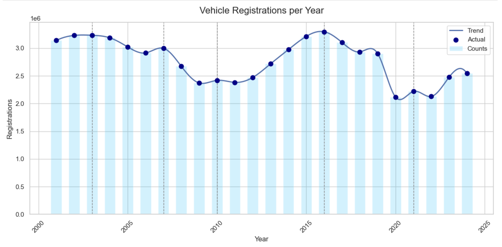
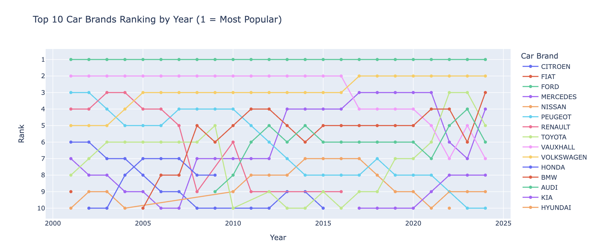
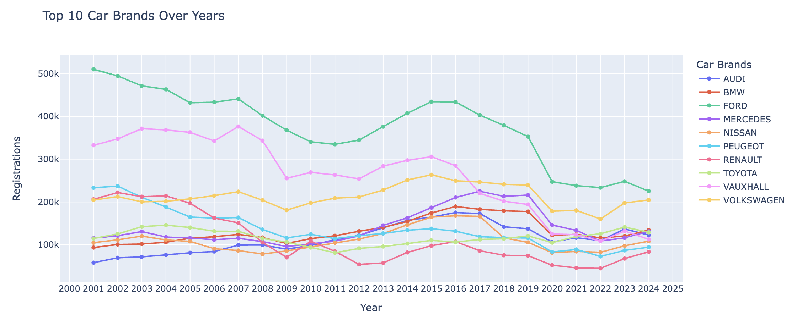
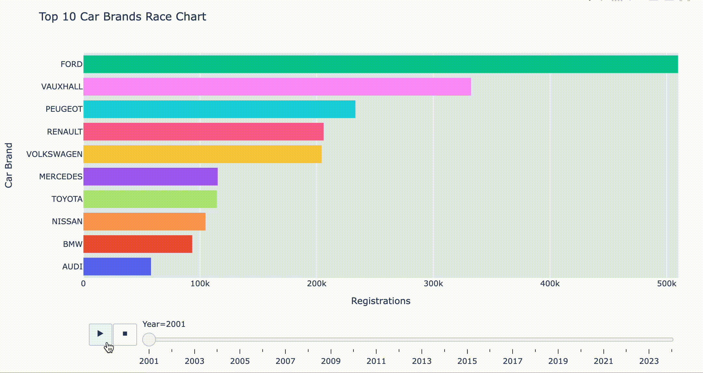

# Vehicle Sales Trend Analysis in Great Britain (2001–2024)

## Project Overview
This project analyzes **automotive sales data** from 2001 to 2024.  
The main objective is to identify **trends in car sales across body types, manufacturers, and fuel types**, and to highlight how the market has evolved.

## Dataset
- **Rows**: 102,892  
- **Columns**: 102  
- Features:
  - `BodyType`, `Make`, `GenModel`, `Model`, `Fuel`
  - Quarterly sales data from **2001Q1 to 2025Q1**

## Tools & Libraries
- Python (Pandas, NumPy)
- Visualization: Matplotlib, Seaborn, Plotly
- Jupyter Notebook

## Key Steps
1. Data cleaning & preprocessing  
2. Exploratory Data Analysis  
3. Visualization of sales patterns  
4. Insights & business conclusions  

## Results
- Top manufacturers by total sales identified.  
- Shift in fuel type preference observed over time.  
- Clear growth/decline patterns in specific car body types.  

## Vehicle Registrations per Year

## Cars Brands Popularity Visualization
 Top 10 Car Brands Ranking by Year

Top 10 Car Brands Over Years

Top 10 Car Brands Race Chart

